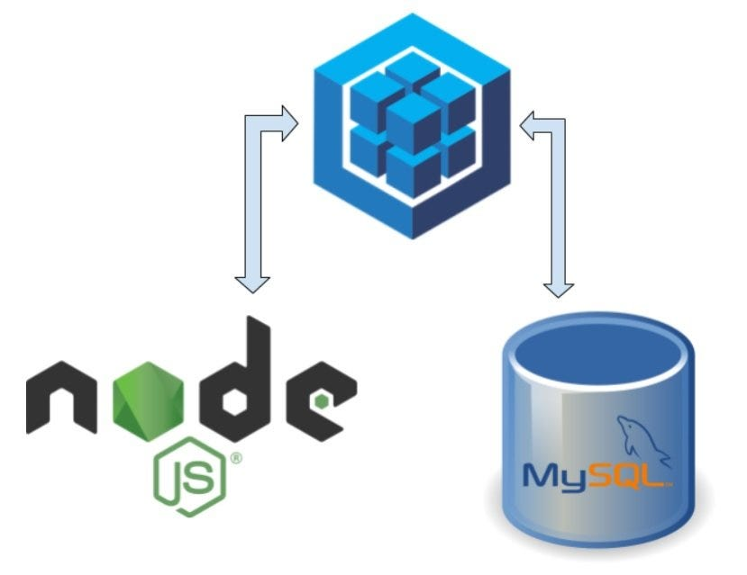

<h2>Happy Open-source learning & sharing :D</h2>
 
<h2>Aim: To demonstrate that we have thoroughly learnt the contents</h2>
<h2>Technologies involved: </h2>
<ul>
    <li>MVC Architecture</li>
    <li>Embedded JavaScript (EJS)</li>
    <li>Node.js</li>
    <li>MySQL</li>
    <li>Seqeulize ORM</li>
</ul>

 
<h3>Start practicing with this Node.js MySQL Sequelize ORM app</h3>
<h3>git clone https://github.com/PhoenixYork166/Node-MySQL-Sequelize.git</h3>
<h3>cd Nodejs-MySQL-Sequelize</h3>
<h3>npm install</h3>
